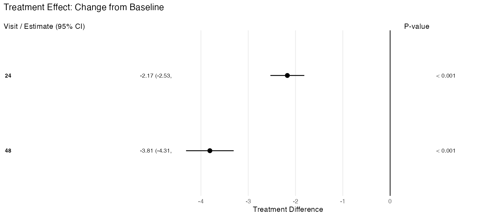
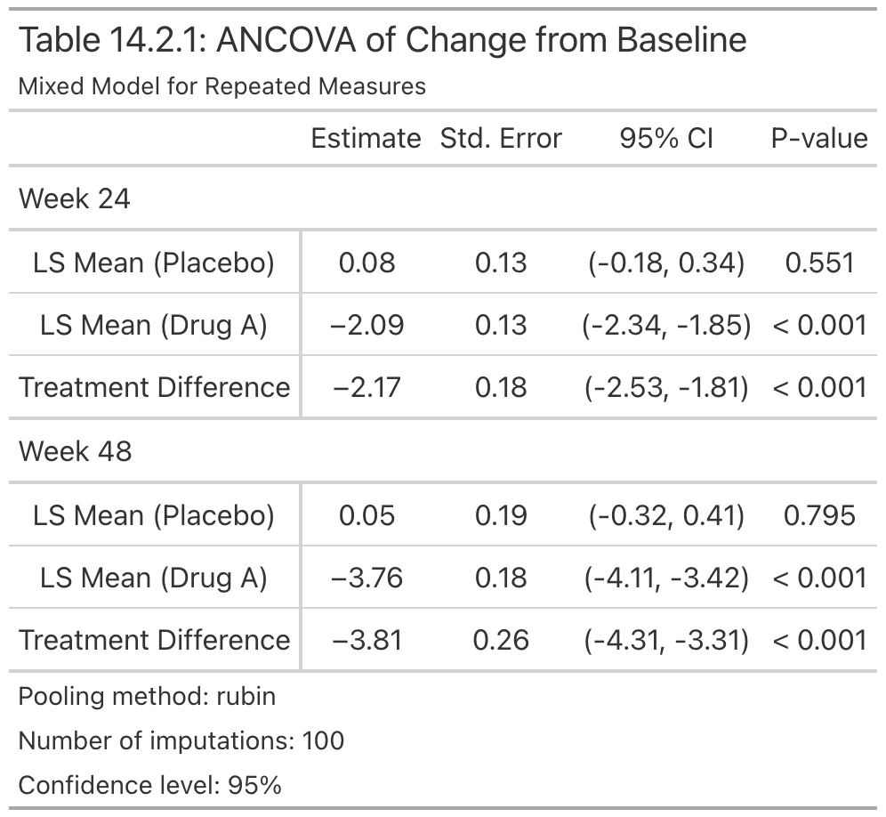

<!-- README.md is generated from README.Rmd. Please edit that file -->

```{r, include = FALSE}
knitr::opts_chunk$set(
  collapse = TRUE,
  comment = "#>",
  fig.path = "man/figures/README-",
  out.width = "100%"
)
```

# rbmiUtils <a href="https://openpharma.github.io/rbmiUtils/">  </a>

<!-- badges: start -->

[](https://lifecycle.r-lib.org/articles/stages.html#experimental)

[](https://github.com/openpharma/rbmiUtils/actions/workflows/R-CMD-check.yaml)
[](https://github.com/openpharma/rbmiUtils/actions/workflows/test-coverage.yaml)
<!-- badges: end -->

`rbmiUtils` bridges [rbmi](https://github.com/openpharma/rbmi) analysis results into publication-ready regulatory tables and forest plots. It extends rbmi for clinical trial workflows, handling everything from data validation through to formatted efficacy outputs.

## Installation

You can install the package from CRAN or the development version from GitHub:

Type | Source | Command
---|---|---
Release | CRAN | `install.packages("rbmiUtils")`
Development | GitHub | `remotes::install_github("openpharma/rbmiUtils")`

## What You Get

From a single rbmi pool object, `rbmiUtils` produces publication-ready outputs:

**Forest Plot**



**Efficacy Table**



These outputs are generated from a single rbmi pool object -- see the [end-to-end pipeline vignette](https://openpharma.github.io/rbmiUtils/articles/pipeline.html) for the complete walkthrough.

## Quick Start

```{r quick-start, eval = FALSE}
library(rbmiUtils)
library(rbmi)

# Load pre-imputed data
data("ADMI")
ADMI$TRT     <- factor(ADMI$TRT, levels = c("Placebo", "Drug A"))
ADMI$USUBJID <- factor(ADMI$USUBJID)
ADMI$AVISIT  <- factor(ADMI$AVISIT)

# Define variables and method
vars <- set_vars(
  subjid = "USUBJID", visit = "AVISIT", group = "TRT",
  outcome = "CHG", covariates = c("BASE", "STRATA", "REGION")
)
method <- method_bayes(
  n_samples = 100,
  control = control_bayes(warmup = 200, thin = 5)
)

# Analyse, pool, and tidy
ana_obj  <- analyse_mi_data(data = ADMI, vars = vars, method = method)
pool_obj <- pool(ana_obj)
tidy_df  <- tidy_pool_obj(pool_obj)

# Publication outputs
efficacy_table(pool_obj, arm_labels = c(ref = "Placebo", alt = "Drug A"))
plot_forest(pool_obj, arm_labels = c(ref = "Placebo", alt = "Drug A"))
```

## Key Features

- `validate_data()` -- pre-flight checks on data structure before imputation
- `analyse_mi_data()` -- run ANCOVA (or custom analysis) across all imputations
- `tidy_pool_obj()` -- tidy pooled results with visit-level annotations
- `efficacy_table()` -- regulatory-style gt tables (CDISC/ICH Table 14.2.x format)
- `plot_forest()` -- three-panel forest plots with estimates, CIs, and p-values
- `pool_to_ard()` -- convert pool objects to pharmaverse ARD format
- `get_imputed_data()` -- extract long-format imputed datasets
- `format_pvalue()` / `format_estimate()` -- publication-ready formatting

## Learn More

- [From rbmi Analysis to Regulatory Tables](https://openpharma.github.io/rbmiUtils/articles/pipeline.html) -- end-to-end walkthrough from raw data to regulatory outputs
- [Storing and Analyzing Imputed Data](https://openpharma.github.io/rbmiUtils/articles/analyse2.html) -- focused guide on analysis workflows
- [Package documentation](https://openpharma.github.io/rbmiUtils/)

## Development Status

This package is experimental and under active development. Feedback and contributions are welcome via [GitHub issues](https://github.com/openpharma/rbmiUtils/issues) or pull requests.
